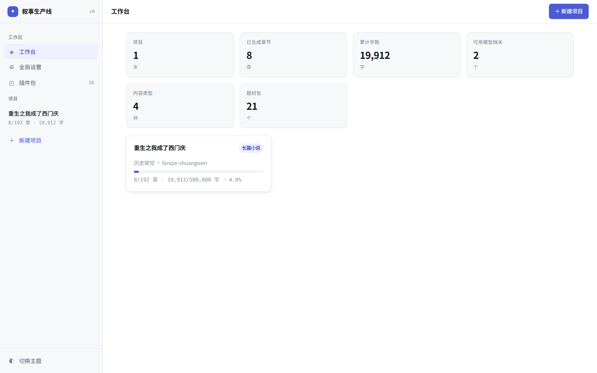
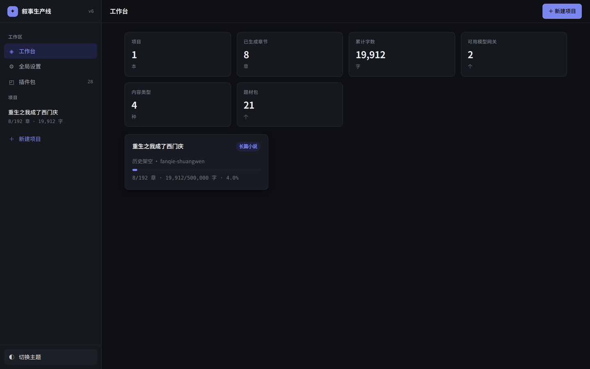
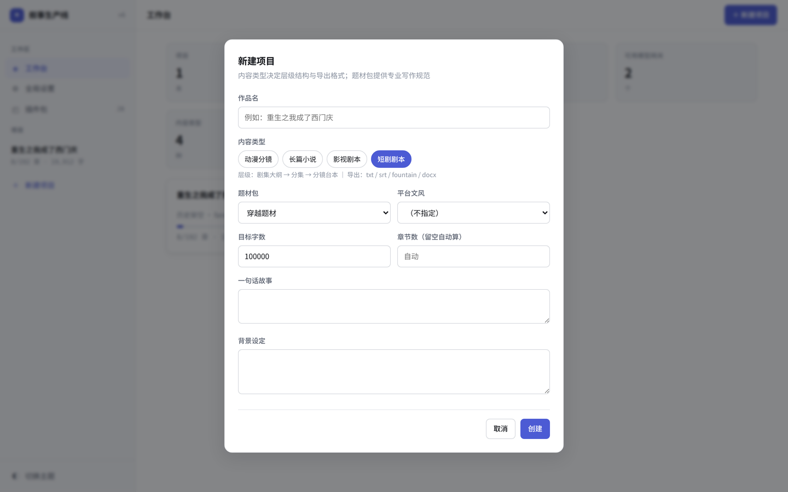
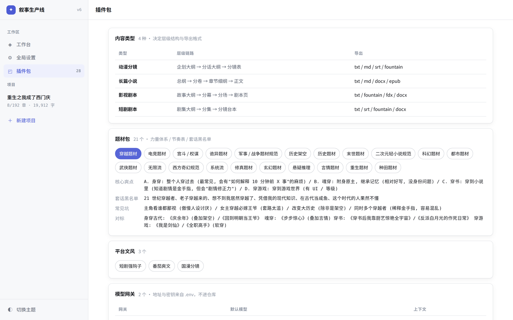
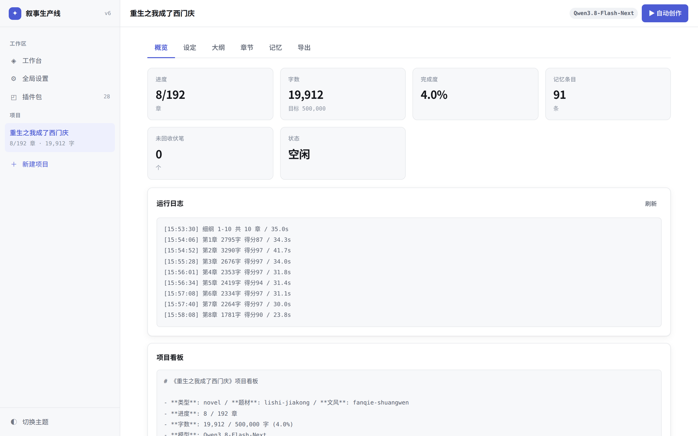
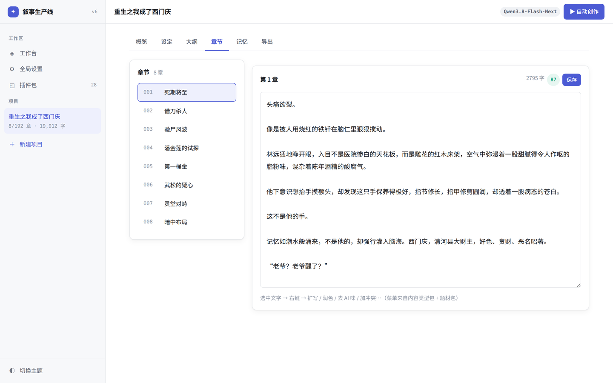
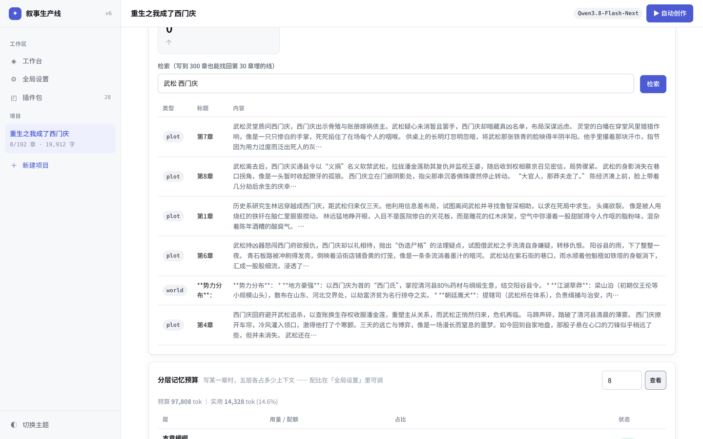
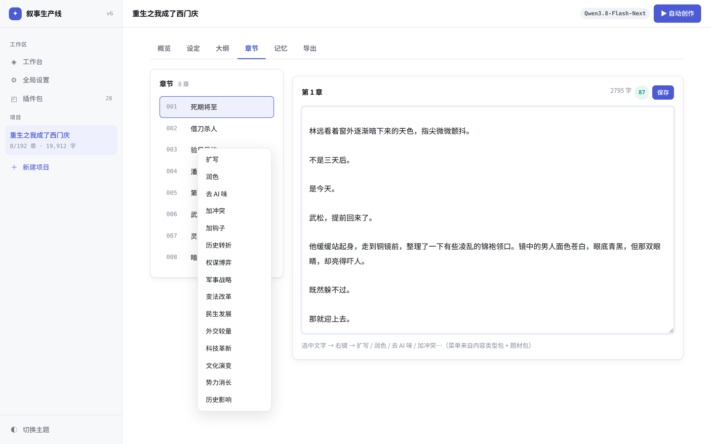
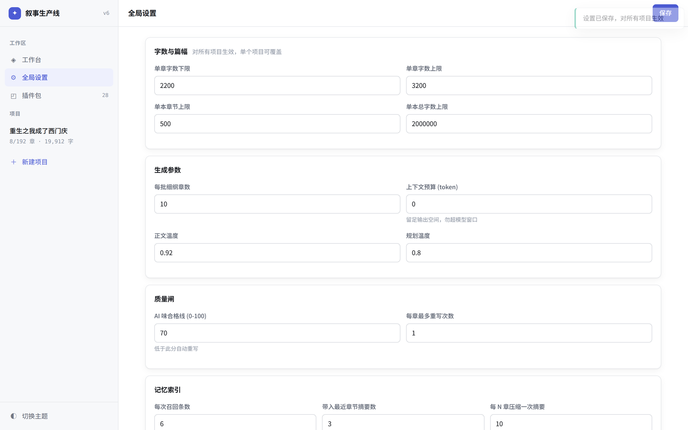

# AI 叙事内容生产线

> 从「AI 小说创作助手 v5.2」重构而来。
> 不只是写小说 —— **一次设定，多态输出**：长篇小说 / 影视剧本 / 短剧台本 / 动漫分镜。

一套可插拔的长文本创作引擎：**内容类型、题材知识、模型供应商、导出格式全部是插件**，
代码里不写死任何一种体裁。配合分层记忆与质量闸，能无人值守连续写完几十万字。

---

## 它能做什么

```
一句话设定
   ↓
世界观圣经 → 角色档案 → 总纲 → 分卷 → 分章细纲 → 逐章正文
                                              ↓
                                  AI 味自审 → 不合格自动重写
                                              ↓
                         txt / md / 大纲 / Fountain 剧本 / SRT 字幕
```

**实测**（Qwen3.8-Flash-Next 自建 vLLM，110k 窗口）：

| 指标 | 重构前 | 重构后 |
|---|---|---|
| **全书体检** | 20 / 100 | **96 / 100** |
| 架空世界出现真实历史人物 | 47 次 | **0** |
| 朝代名穿帮（宋律/大宋…） | 56 次 | **0** |
| 口癖密度（每万字） | 20.8 | **6.9** |
| 全书问题条数 | 7 | **1** |
| 单章耗时 | — | 41 秒（含检索、自审、不合格重写） |
| 记忆体预算 | — | 97,808 tok（按网关窗口自动推导，限定 32k–100k） |
| 测试 | 无 | 单元 39 + E2E 22 |

完整对比见 [`docs/QUALITY_REPORT.md`](docs/QUALITY_REPORT.md)。

---

## 界面

<table>
<tr>
<td width="50%"><br><sub><b>工作台</b> — 项目进度、字数、可用网关与插件包一览</sub></td>
<td width="50%"><br><sub><b>暗色主题</b> — 跟随系统或手动切换，两套完整配色</sub></td>
</tr>
<tr>
<td><br><sub><b>新建项目</b> — 切换内容类型，层级链路与导出格式随之变化（短剧：剧集大纲 → 分集 → 分镜台本）</sub></td>
<td><br><sub><b>插件包</b> — 4 种内容类型 / 21 个题材包 / 3 个文风包，点题材可看黑名单与常见坑</sub></td>
</tr>
<tr>
<td><br><sub><b>项目概览</b> — 进度、AI 味均分、未回收伏笔、实时运行日志</sub></td>
<td><br><sub><b>章节</b> — 正文可编辑，右上角实时显示字数与 AI 味评分</sub></td>
</tr>
<tr>
<td><br><sub><b>分层记忆</b> — FTS5 检索召回 + 五层预算占用可视化，配比可调</sub></td>
<td><br><sub><b>右键改写</b> — 选中正文局部改写，v5.2 的 130 条题材指令全部保留</sub></td>
</tr>
<tr>
<td><br><sub><b>全局设置</b> — 字数区间、质量闸、记忆配比、统一写作偏好</sub></td>
<td><br><sub><b>导出</b> — 一份设定导出小说 / 大纲 / Fountain 剧本 / SRT 字幕</sub></td>
</tr>
</table>

<p align="center"><br><sub>窄屏 420px 不破版</sub></p>

---

## 五分钟跑起来

```bash
git clone <repo> && cd AI-automatically-generates-novels
pip install -r requirements.txt
python3 -m playwright install chromium      # 只跑服务可跳过

cp .env.example .env && vim .env            # 填模型地址与密钥
bash scripts/setup.sh                       # docker compose 起全套（含自带 SearXNG）
```

不想用 docker：

```bash
pip install -r requirements.txt
bash scripts/serve.sh start                 # → http://127.0.0.1:60001/
```

`.env` 最少填一个网关：

```ini
NOVEL_GW1_URL=http://your-vllm-host:8000/v1
NOVEL_GW1_KEY=EMPTY
NOVEL_GW1_MODEL=Qwen3.8-Flash-Next
```

> **只有 `/` 一个页面路由**。老版的 `/bingte` 已废弃。
> **`.env` 在 `.gitignore` 里，仓库中不含任何真实地址或密钥。**

命令行自动写作（可断点续跑）：

```bash
python3 run_novel.py init --title "重生之我成了西门庆" \
    --genre lishi-jiakong --style fanqie-shuangwen --words 500000 \
    --premise "历史系研究生穿越成西门庆，三天后武松就要来报仇"

python3 run_novel.py run    --title "重生之我成了西门庆" --chapters 20
python3 run_novel.py status --title "重生之我成了西门庆"
```

关掉终端、重启服务、换模型都能从 `state.json` 接着写。

---

## 架构：四层可插拔

```
┌──────────────────────────────────────────────────────────┐
│  UI (web/)  面板 / 层级 / 右键菜单 全部由配置渲染，无硬编码  │
└────────────────────────┬─────────────────────────────────┘
┌────────────────────────▼─────────────────────────────────┐
│  编排层 (server/orchestrator.py)                          │
│  世界观→角色→总纲→细纲→正文→自审→重写  断点续写 / 分层记忆   │
└──┬──────────┬───────────┬────────────┬───────────────────┘
┌──▼─────┐ ┌──▼────────┐ ┌▼──────────┐ ┌▼─────────┐
│Provider│ │ContentType│ │ GenrePack │ │ Exporter │
│ 模型   │ │  体裁     │ │  题材     │ │  导出    │
├────────┤ ├───────────┤ ├───────────┤ ├──────────┤
│OpenAI  │ │长篇小说   │ │修真 玄幻  │ │txt md    │
│兼容    │ │影视剧本   │ │武侠 都市  │ │大纲      │
│(vLLM / │ │短剧台本   │ │历史架空   │ │fountain  │
│ 各网关)│ │动漫分镜   │ │… 21 个    │ │srt       │
└────────┘ └───────────┘ └───────────┘ └──────────┘
       放一个文件即扩展，拔掉即卸载
```

### 目录

```
server/       providers/  registry  orchestrator  memory  memory_ctl
              prompt_engine  evaluator  exporters  settings  app
packs/        type/  genre/  style/  common/  shortcuts/
web/          index.html  css/  js/(api ui views app)
config/       providers.yaml  settings.yaml
tests/e2e/    run.py            projects/  运行时项目目录
```

---

## 核心机制

### 1. 模型适配：吃掉「OpenAI 兼容」的不兼容

同一套 API，各家思考字段名都不一样（实测）：

| 模型 | 思考字段 | 备注 |
|---|---|---|
| `Qwen3.8-Flash-Next`（自建 vLLM） | `reasoning` | 非标准 |
| `qwen3.8-max / flash`（聚合网关） | `reasoning_content` | DeepSeek 系约定 |
| Anthropic / Gemini 兼容层 | `thinking` / `thought` | 且 `content` 是 **块数组** |
| 文心一言兼容层 | — | 正文字段叫 `result` |
| Ollama 兼容层 | — | 内容嵌在 `message` 里 |
| 多数模型 | — | 只有 `content` |

正文字段同样做了形状兼容：字符串 / `[{"type":"text","text":…}]` / `[{"text":…}]` /
`{"text":…}` / 字符串数组 / `message` 嵌套，共 11 种形状实测通过。

老版只读 `delta.content`，接 Qwen3.8 **输出一片空白**。现在：三种命名全兼容，
`content` 为空时先从 `<answer>` 标签抢救，再不行自动**关思考重试**。

> **创作任务默认关思考**。实测 `qwen3.8-flash` 开思考写 338 字正文烧掉 2186 字思考
> （86.6% 浪费），首字慢 6.6 倍，质量无差别。只在规划 / 体检 / 打分时开。

**接新模型先跑自检** —— 插件包页每个网关有「自检」按钮，或直接调接口：

```bash
curl -s localhost:60001/api/probe -H 'Content-Type: application/json' \
     -d '{"gateway":"gw1"}'
# → fields_seen: ["content"]  first_token_s: 0.83  diagnosis: 正常：内容走 content
```

它会打一发真实请求，报告该网关**实际用的字段名**、首字延迟、是否需要 `<answer>` 抢救。
接入出现空白时先跑这个，一眼定位是字段名对不上还是模型本身不返回。

分层调度在 `config/providers.yaml`：

```yaml
profiles:
  planning:  {gateway: gw1, thinking: false, temperature: 0.80}   # 世界观 / 总纲
  drafting:  {gateway: gw1, thinking: false, temperature: 0.92}   # 正文，占 90% 调用
  polishing: {gateway: gw1, thinking: false, temperature: 0.85}   # 润色 / 重写
  judging:   {gateway: gw1, thinking: true,  temperature: 0.30}   # 体检 / 打分
```

### 2. 自我改进循环：写几章就自己读一遍

```
写 N 章 → 全书体检 + 邻章窗口体检 → 抽样正文交 critic 读
        → 产出《本书写作守则》 → 注入后续每一章的约束 → 继续写
```

光把分数打出来没用，必须把「哪里不好、下次怎么写」变成**可执行的守则文本**。
守则每 5 章更新一次（`quality.reflect_every`），分数轨迹记在 `reflect_log.json`。

**质检是三层的**，缺一层都会漏：

| 层 | 抓什么 | 单靠它为什么不够 |
|---|---|---|
| 单章 | 套话密度、结构残留、字数、对话占比 | 「嘴角勾起」一章 1 次不超标 |
| **邻章窗口** | 与前 3 章重复度、开场雷同、剧情原地踏步、角色断线 | 全书统计看不出「这三章在同一场冲突里绕」 |
| **全书** | 口癖泛滥、禁用术语、主角戏份垄断、配角纸片化、主场漂移 | 逐章 95.2 分的稿子，全书体检只有 29 分 |

三层结论**全部回流到下一章的约束**，而不是写完才发现。

### 3. 长程一致性：伏笔 / 角色状态 / 时间线

每章写完做一次结构化抽取（与摘要合并成一次调用，不额外花钱）：

- **伏笔**：新埋的自动登记，回收的自动销账；超 15 章未回收进约束层告急
- **角色状态机**：每个角色的所在地 / 身体状态 / 持有物，写进约束「不得凭空改变」
- **时间线**：本章相对上一章过了多久，禁止无说明的时间跳跃

没有这层，人物会瞬移、伤口会自愈、伏笔埋了永不回收。

### 4. 分层记忆：长篇不崩的关键

80k 上下文写不了 50 万字，靠的是**外部档案 + 分层预算**，不是靠长窗口。

| 层 | 内容 | 默认配比 | 超预算时 |
|---|---|---|---|
| **L0** 即时 | 本章细纲 | 10% | 永不裁剪 |
| **L1** 常驻 | 世界观 + 角色档案 | 22% | 截断 |
| **L2** 近程 | 最近 N 章摘要 | 20% | 丢最旧 |
| **L3** 中程 | 每 10 章的段摘要 | 16% | 丢最远 |
| **L4** 远程 | FTS5 检索召回 | 20% | 少召回几条 |
| **L5** 约束 | 题材红线 / 黑名单 / 未回收伏笔 | 8% | 永不裁剪 |

- 预算 = 网关窗口 − 输出预留 − 安全余量，**限定 32k–100k**（低于 32k 一致性会崩）
- 配比在 `config/settings.yaml` 里可调 —— **改配比就是在控制「模型记住什么」**
- 每章的实际占用写进 `projects/<书名>/audit/NNN.ctx.json`，UI「记忆」页可视化

> L4 解决的是：写到第 300 章时，第 30 章埋的伏笔既不在最近摘要里、也不在段摘要的
> 细节里 —— 只能靠 SQLite FTS5 按本章细纲检索找回来。中文用 bigram 切分，不依赖分词器。

### 5. 资料检索：内建，不是外挂

检索是**框架里的一类 provider**（`server/providers/search.py`），与模型网关并列，
配在同一份 `providers.yaml`，`docker compose up` 时自带的 SearXNG 一起起来。

**查什么由大模型决定**，不是正则匹配关键词。实测都市重生场景：

| | 结果 |
|---|---|
| 正则触发词 | 只抓到 1 条废话（`2008 年份与纪事`） |
| **大模型规划** | 微软 2008 漏洞悬赏计划 / XP 高危漏洞 / 非遗商标法律可行性 / 县级领导巡查私企流程 / 电脑管家 2008 市场情况 |

检索铺在**四个环节**，不是只在写正文时：

```
世界观  ← 政治/经济/军制/阶层/律法      （器物官制不靠编）
人物表  ← 姓名习惯/称谓/职业/女性地位    （称谓不穿帮）
章节剧情 ← 饮食器物/行程/礼俗           （不写出不属于该时代的东西）
正文    ← 本章细纲里需要查证的具体点      （查过的全书复用）
```

查什么由**题材包**决定：都市查股市融资、电竞查赛事规则、修真查典籍原型、
重生查该年份的房价与产品发布。检索不可用时自动降级为纯内部记忆，不阻塞写作。

### 6. 题材知识：从 3 行提示词到 21 个专业包

`packs/genre/*.json` 每个包含：核心爽点、力量/境界体系、各阶段章节数、人物配置、
金手指规则、常见坑、**套话黑名单**、对标作品。黑名单双路使用 —— 生成时作为负向约束
注入，生成后交给审查器判分。

### 7. 质量闸：写完即自审

`server/evaluator.py` 检测 9 类问题：`【】`心理描写、markdown 残留、通用/小说套话、
**题材专属黑名单**、空洞形容词密度、句式重复、对话占比、段落节奏、字数偏离。
低于合格线（默认 70）自动重写一次，取分高的版本。

### 8. 全面可编辑与两种运行模式

**每个产物都能改**：基础设定、世界观、角色档案、时代红线卡、写作守则、总纲、
每章细纲、正文、本书提示词模板 —— 全部前端直接编辑保存，保存联动重建索引与花名册。

**提示词可覆盖**：「提示词」页可为本书覆盖 5 类模板（世界观/角色/总纲/细纲追加/
正文追加），页面列出全部可用变量（`${title}` `${genre_rules}`…），留空用内置。

**两种模式**：
- 全自动 —— 一路写到底
- 阶段自动 —— 世界观→停→角色→停→总纲→停→每批章节→停；每停一次
  可审阅/编辑任何产物，点「审阅完毕，继续」放行

### 9. 右键局部改写与章节重写

**右键局部改写**（老版的灵魂，一条没丢）

选中正文 → 右键 → 扩写 / 润色 / 去 AI 味 / 加冲突 / 加钩子…
菜单来自**内容类型包 + 题材包**，v5.2 的 13 个题材共 **130 条指令**全部保留。
改写结果可一键替换回正文并重新评分。

**整章重写三模式**：`polish`（剧情不动只改语言）/ `replace`（整章重写）/
`fork`（分叉另一条线）。旧稿一律先备份到 `.ckpt/`，剧情有变时提示下游受影响的章节。

```bash
python3 run_novel.py rewrite --title "书名" --chapter 7 --mode polish --note "节奏太拖"
```

---

## 加一个插件

**加模型网关** — `config/providers.yaml` 加一段 + `.env` 加两个变量，零代码。

**加内容类型** — 新建 `packs/type/xxx.json`：

```jsonc
{
  "id": "shortdrama", "name": "短剧剧本",
  "fields": [{"id":"hook","label":"黄金三秒钩子","type":"text"}],
  "levels": [                                    // 任意深度
    {"id":"series","name":"剧集大纲","single":true,"prompt":"..."},
    {"id":"episode","name":"分集","splitter":"###fenge","prompt":"..."},
    {"id":"shot","name":"分镜台本","prompt":"..."}
  ],
  "menus": {"shot":[{"name":"加反转","prompt":"...${selected_text}"}]},
  "exporters": ["txt","srt","fountain"]
}
```

放进目录就出现在 UI 里。**给小说加一层「小纲」，就是往 `levels` 数组插一个元素。**

**加题材包** — `packs/genre/xxx.json`，或用 `scripts/` 里的转换脚本把
Markdown 写作规范批量转成结构化包。

**加导出格式** — `server/exporters.py` 写个函数，`EXPORTERS` 注册一行。

---

## 统一配置

`config/settings.yaml` 对所有项目生效，UI「全局设置」页可直接改：

```yaml
generation:
  chapter_words_min: 2200        # 单章字数下限
  chapter_words_max: 3000        # 单章字数上限
  context_budget: auto           # 记忆体，auto=按网关窗口推导
  min_context_budget: 32000      # 下限
  max_context_budget: 100000     # 上限
limits:
  max_chapters: 500              # 单本章节上限
  max_total_words: 2000000       # 单本字数上限
quality:
  audit_pass_score: 70           # 低于此分自动重写
memory:
  top_k: 6                       # 每次召回条数
  layers: {L0_outline: 0.10, L1_resident: 0.22, L2_recent: 0.20,
           L3_mid: 0.16, L4_recall: 0.20, L5_constraint: 0.08}
style_defaults:                  # 全局写作偏好，拼进每次提示词
  narration: 第三人称限制视角
  extra: "多用短句，少用比喻"
banned_global: [总而言之, 综上所述]
```

---

## 测试

```bash
python3 -m pytest tests/unit -q         # 单元边界测试（39 条，<1s）
bash scripts/serve.sh start
python3 tests/e2e/run.py                # E2E 22 条，真实浏览器 + 真实模型
python3 tests/e2e/run.py --case 18      # 单条
```

**单元层**（`tests/unit/`）：
- 记忆体：FTS5 中文 bigram、upsert 去残留、伏笔生命周期、五层预算分配的
  零预算/微预算/丢最旧、**类型防呆**（dict 混入 List[str] 即报）
- 引擎：`${x}` 全局替换（老版 .replace 只换首个的回归锁）、预算裁剪、
  剧情条数随字数配额压缩、`[本章未出现]` 标记
- 评估器：弯引号对话识别、套话变体、密度而非绝对次数、环境开篇判定
- **变量遮蔽静态追踪**：AST 扫描受保护变量的多次实义赋值（此坑踩过两次，
  空容器初始化/`+=`/except 兜底豁免，仍能抓到当年的真事故形态）；
  以及 scripts 禁用 `pkill -f`（会误杀自身）

**E2E 层**（`tests/e2e/run.py`，22 条）：渲染/主题/导出/右键菜单分组筛选/
记忆五层可视化/真实流式（reasoning 坑回归）/**全面可编辑审阅**（9 个可编辑面
逐块真编辑真保存刷新验证，隔离测试项目自删）/阶段模式/**UI 可用性**（全部页面
标签可达且零 JS 错误）/**UI 简易性**（新建三步可达、正文两步可见）。

---

## 项目目录结构

每本书一个独立目录，可直接拷走：

```
projects/<书名>/
├── project.json          # 元信息
├── state.json            # 进度 / 摘要 / 日志（断点续写靠它）
├── PROJECT_BOARD.md      # 一眼看全进度与质量
├── world_bible.md        # 世界观圣经
├── characters.md         # 角色档案
├── outline.md            # 总纲
├── chapter_outlines.json # 分章细纲
├── chapters/001.md …     # 正文
├── l2_summary/           # 每 10 章压缩摘要
├── audit/NNN.json        # 每章质量评分
├── audit/NNN.ctx.json    # 每章记忆分层占用
└── memory.db             # FTS5 记忆索引
```

---

## 从 v5.2 迁移

| | v5.2 | 现在 |
|---|---|---|
| 入口 | `/` 404，只有 `/bingte` | 只有 `/` |
| 接 Qwen3.8 | 输出空白 | 正常 |
| 写长篇 | 手动逐章 | 全自动 + 断点续写 |
| 层级 | 焊死 3 级 | 配置驱动，任意深度 |
| 体裁 | 只有小说 | 小说 / 剧本 / 短剧 / 动漫分镜 |
| 题材 | 3 行字符串 | 21 个专业包 |
| 存储 | localStorage 5MB | 文件 + SQLite |
| 密钥 | 明文进 git | `.env`，仓库零凭据 |
| 测试 | 无 | 13 条 E2E |

v5.2 的提示词资产已抢救进 `packs/shortcuts/`：130 条题材右键指令 + 24 条修真快捷词条。
老代码在 `main` 分支可查。

---

## 设计文档

架构决策、实测数据、分阶段路线见 [`REFACTOR_PLAN.md`](REFACTOR_PLAN.md)。

## License

见 [LICENSE](LICENSE)。
